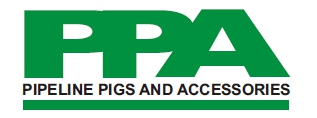
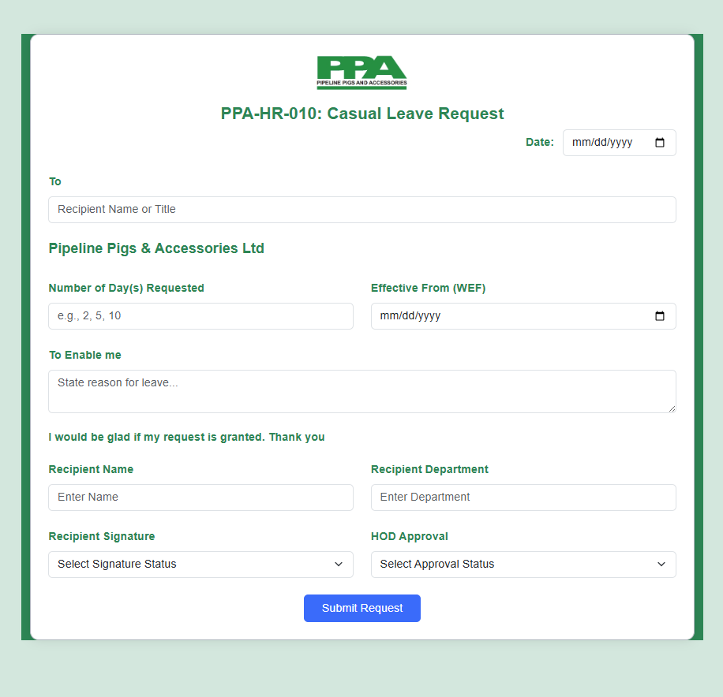

# Pipeline Pigs and Accessories Limited – HR Forms

This repository contains **responsive, branded, and policy-compliant HR forms** developed for **Pipeline Pigs and Accessories Limited**, a Pipeline Flow Assurance Company. These forms promote organized documentation, transparency, and proper leave management.

---

## 📄 Casual Leave Request Form (`PPA-HR-010`)

### ✅ Key Features:

* **Company Branding**

  * Includes the official logo
  * Document title: **PPA-HR-010: Casual Leave Request**

* **Form Details**

  * Form Date (auto-filled or selected)
  * Recipient field ("To")
  * Static company name: *Pipeline Pigs & Accessories Ltd*

* **Leave Request Inputs**

  * Number of Day(s) Requested
  * Effective From (WEF) date
  * Text area for specifying the reason ("To enable me...")

* **Gratitude Section**

  * Statement of appreciation: *“I would be glad if my request is granted. Thank you”*

* **Personnel Section**

  * Recipient Name
  * Department
  * Signature Status (dropdown)
  * HOD Approval (dropdown)

* **UI & Layout**

  * Built with **Bootstrap 5.3**
  * Consistent visual styling using `text-success`, `bg-success`, and `form-label`
  * Responsive design for desktop and mobile
  * Clean and print-friendly structure

---

## 📂 Folder Structure

```
├── index.html           # Casual Leave Request Form (PPA-HR-010)
├── style.css            # Custom styles for the form
├── img/
│   └── logo.png         # Company logo
```

---

## 🖼️ Screenshots

### ✅ Logo Preview


### ✅ Casual Leave Request


---

## 🚀 How to Use

1. Fill in the **date**, **recipient**, and **number of leave days**.
2. Select the **effective (WEF) date**.
3. State the **reason for leave** in the text area.
4. Provide the **recipient’s name**, **department**, and select signature and approval status.
5. Submit the request for processing.

---

## 🛠️ Technologies Used

* **HTML5** – Semantic markup
* **CSS3** – Form layout and branding
* **Bootstrap 5.3** – Responsive grid system and styled components

---

## 📖 Tags

`#CasualLeaveForm` `#HRForms` `#PipelinePigs` `#Bootstrap5`
`#LeaveRequest` `#HTMLForms` `#HRWorkflow` `#ResponsiveDesign`

---

**📌 Developed to streamline leave documentation and approval processes at Pipeline Pigs and Accessories Limited.**
